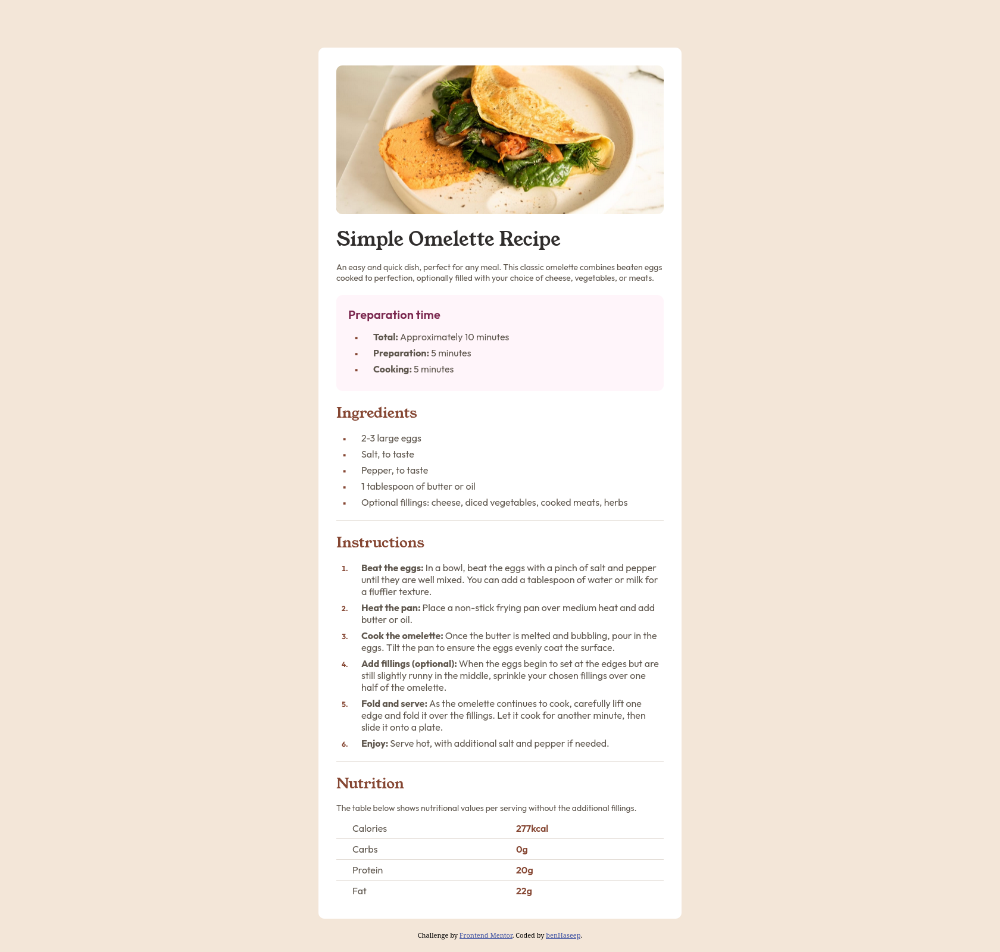

# Frontend Mentor - Recipe page solution

This is a solution to the [Recipe page challenge on Frontend Mentor](https://www.frontendmentor.io/challenges/recipe-page-KiTsR8QQKm). Frontend Mentor challenges help you improve your coding skills by building realistic projects. 

## Table of contents

- [Frontend Mentor - Recipe page solution](#frontend-mentor---recipe-page-solution)
  - [Table of contents](#table-of-contents)
  - [Screenshot](#screenshot)
  - [Links](#links)
  - [Built with](#built-with)
  - [Author](#author)

## Screenshot

## Links

- Solution URL: [Source Code](https://github.com/benHaseep/recipe-page)
- Live Site URL: [Live Preview](https://benHaseep.github.io/recipe-page)

## Built with

- Semantic HTML5 markup
- CSS custom properties
- Flexbox

## Author

- Website - [benHaseep](https://benHaseep.github.io)
- Frontend Mentor - [@benHaseep](https://www.frontendmentor.io/profile/benHaseep)
- Twitter - [@benHaseep](https://www.twitter.com/benHaseep)